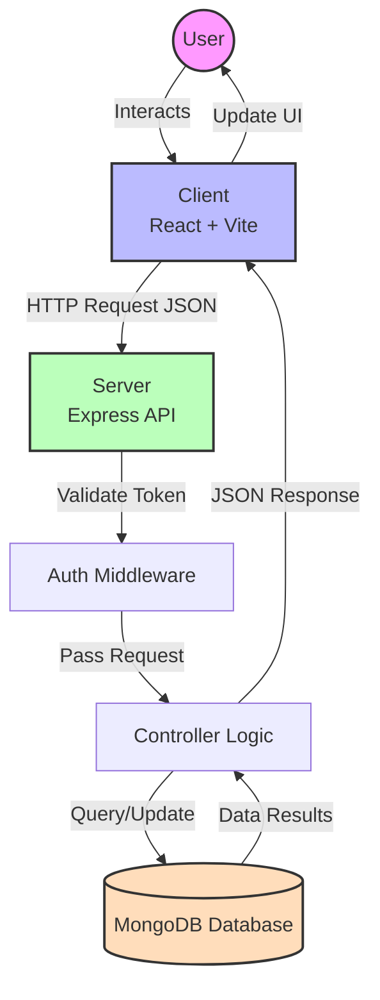

# Project Architecture and Data Flow

This document outlines how the **MentorConnect** project works and how data flows through the application.

## High-Level Architecture

The project follows a standard **MERN Stack** (MongoDB, Express, React, Node.js) architecture:

1.  **Client (Frontend)**: Built with **React** (using Vite) and **Tailwind CSS**. It serves as the user interface for Users and Mentors.
2.  **Server (Backend)**: Built with **Node.js** and **Express**. It handles API requests, authentication, and business logic.
3.  **Database**: **MongoDB** is used to store all application data (Users, Mentors, Bookings, etc.), managed via **Mongoose** models.

---

## Data Flow Diagram

The following flowchart illustrates the typical data flow when a user interacts with the application (e.g., booking a session).



---

## Technical Data Passing & Retrieval

This section explains *exactly* how data moves between the Frontend and Backend using code examples from the project.

### 1. Client-Side: Sending Data (Axios)
The frontend uses **Axios** (configured in `client/src/utils/api.js`) to communicate with the server.

*   **Base Configuration**: Requests are sent to `/api` (e.g., `http://localhost:5000/api`).
*   **Authentication**: An interceptor automatically attaches the **JWT Token** from `localStorage` to every request header.

**Code Example (`client/src/utils/api.js`):**
```javascript
// 1. Auth Headers are auto-injected
api.interceptors.request.use((config) => {
  const token = localStorage.getItem('token');
  if (token) {
    config.headers.Authorization = `Bearer ${token}`; // Data passed via Headers
  }
  return config;
});
```

**Example Request (Booking a Session):**
```javascript
// Data passed via JSON Body
await api.post('/bookings', {
  mentor: '64f8a...', // Mentor ID
  sessionDate: '2023-10-25',
  duration: 60
});
```

### 2. Server-Side: Receiving Requests (Express)
The server receives the request in `server/server.js` and routes it to the appropriate controller.

*   **Middleware**: `express.json()` middleware parses the incoming JSON body.
*   **Controller**: Extracts data from `req.body` (data sent by user) and `req.params` (URL parameters).

**Code Example (`server/controllers/bookingController.js`):**
```javascript
export const createBooking = async (req, res, next) => {
  // 1. Receive Data
  const { mentor, sessionDate, duration } = req.body; // From Frontend JSON
  const userId = req.user.id; // From Auth Middleware (decoded Token)

  // 2. Process Logic (Talk to Database)
  const booking = await Booking.create({
    mentee: userId,
    mentor,
    sessionDate,
    duration
  });

  // 3. Send Response (Pass Data Back)
  res.status(201).json({
    success: true,
    message: 'Booking created successfully',
    data: booking // The actual data object
  });
};
```

### 3. Database Interaction (Mongoose)
The server communicates with MongoDB using Mongoose models.

*   **Querying**: `await Booking.find({ ... })`
*   **Saving**: `await newBooking.save()`

---

# Detailed Page-by-Page Workflow

This section breaks down the application flow page by page.

## 1. Public Pages

### Landing Page (`/`)
*   **Purpose**: Introduction to MentorConnect.
*   **Data Flow**: Static content (no API calls).

### Login (`/login`)
*   **Purpose**: Authenticate user.
*   **Data Passed**: `{ email, password }` via `POST`.
*   **Data Returned**: `{ token, user }`. The client saves the `token` for future requests.

## 2. Core Features

### Find Mentors (`/mentors`)
*   **Purpose**: Browse mentors.
*   **Request**: `GET /api/mentors?category=Coding`
*   **Data Retrieval**:
    1.  Client sends GET request.
    2.  Server queries `Mentor` collection, filtering by category.
    3.  Server populates `user` field (joining with User collection) to get names/avatars.
    4.  Server returns `[ { name: "Alice", skill: "Coding" }, ... ]`.

### Mentor Profile (`/mentors/:id`)
*   **Purpose**: specific mentor details.
*   **Request**: `GET /api/mentors/12345` (ID passed in URL params).
*   **Data Retrieval**: Server finds specific document by `_id`.

## 3. Dashboards

### Mentee Dashboard (`/mentee/dashboard`)
*   **Purpose**: View my bookings.
*   **Request**: `GET /api/bookings/user/:myUserId`
*   **Data Retrieval**:
    *   Server finds all bookings where `mentee` matches the user ID.
    *   Results are sorted by date.
    *   Frontend loops through the JSON array to display cards.
